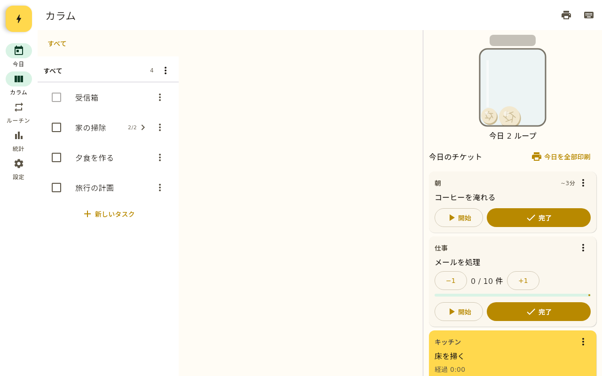
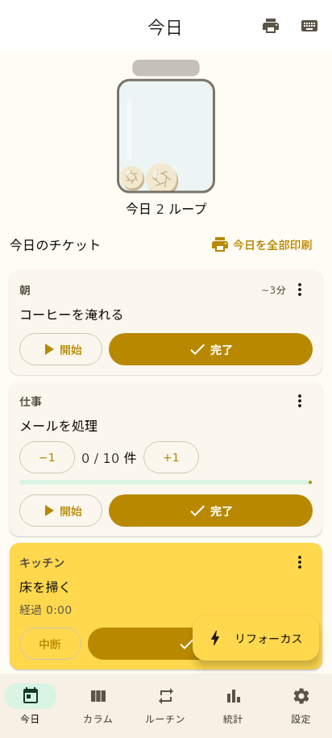

# Jarful（ジャーフル） — ADHD 脳のためのゲームループ型タスク管理

[](https://github.com/kamome-run/jarful/actions/workflows/ci.yml)
[](LICENSE)

「ゲームには何時間でも集中できるのに、仕事や家事は先延ばしにしてしまう」——
ADHD 起業家 Laurie Hérault 氏が編み出した **付箋 × 透明な瓶 × レシートプリンター** の手法
（[ナゾロジー記事](https://nazology.kusuguru.co.jp/archives/180152) /
[原典](https://www.laurieherault.com/articles/a-thermal-receipt-printer-cured-my-procrastination)）を、
Android（Chromebook 対応）と Windows 11 で使えるアプリにしたものです。

> **Jarful** = 「瓶いっぱい」。完了したチケットを丸めて、透明な瓶を満たしていく。

## 仕組み（記事の手法をそのまま）

| 記事の手法 | Jarful での実装 |
|-----------|----------------|
| タスクを 2〜5 分の **マイクロタスク** に分解し、ループ回数を増やす | 階層タスクを **横並びのカラム** で表示。`Tab` 一発で子タスクを追加 |
| 付箋 1 枚 = タスク 1 つ。終わったら **くしゃくしゃに丸めて透明な瓶へ** | 「今日のチケット」を完了すると **丸まるアニメーション＋紙を丸める効果音＋振動**、瓶に紙玉が溜まる |
| 朝は簡単な日課から始めて勢いをつける。**前夜に翌日分を準備** | 曜日別 **ルーチン** を登録すると、準備時刻（既定 21:00）以降に翌日分のチケットを自動生成 |
| 先延ばしに気づいたら **次の 3〜5 個** を書いてすぐ始める | `Ctrl+K` **リフォーカス**: 1 行 1 件で入力→即チケット化→1 枚目を開始 |
| 分解できないタスクは **時間で分解**（「10 分だけ」） | タイムボックス付きチケットのカウントダウン。終了時に「完了 / 5 分延長 / 分解」 |
| 溜まったメールは「新着＋古いもの N 件」を **毎日** | **クォータ型ルーチン**（+1 カウンター、目標到達で完了） |
| **レシートプリンター** で摩擦をなくす | Bluetooth Classic (SPP) / COM ポート / TCP で **ESC/POS・TSPL・CPCL** に印刷。1 チケット 1 枚 |

## スクリーンショット

| Windows / Chromebook（3 ペイン） | スマートフォン | 印刷チケット（58mm ラスター） |
|---|---|---|
|  |  |  |

## 対応プラットフォーム

| プラットフォーム | 配布物 | 備考 |
|------------------|--------|------|
| Android 8.0+ | `jarful-android-*.apk` | スマートフォン / タブレット |
| Chromebook (ChromeOS) | 同上 | タッチ非搭載機でもインストール可。キーボード・マウスで全操作 |
| Windows 11 (x64) | `Jarful-*.msi` / `Jarful-*.exe` | インストーラ。Bluetooth プリンターは仮想 COM ポート経由 |

ビルド成果物は [GitHub Actions](https://github.com/kamome-run/jarful/actions) の Artifacts、
またはリリースページから取得できます。

## 対応プリンター

- **Irfora 57mm ミニポケットサーマルプリンター**（Amazon ASIN B0DNSQ4NWF、Luck Jingle 互換機）— 既定設定
  （Bluetooth / ESC/POS ラスター / 58mm）でそのまま使えます。
- 一般的な 58mm / 80mm の ESC/POS プリンター（Bluetooth SPP、TCP 9100）。
- TSPL / CPCL 対応のラベルプリンター。

### Android / Chromebook（Bluetooth）
1. OS の Bluetooth 設定でプリンターとペアリング。
2. Jarful → 設定 → プリンター → `Bluetooth (SPP)` → 機器を選択 → **テスト印刷**。

### Windows 11（Bluetooth → COM ポート）
1. 設定 → Bluetooth とデバイス → デバイス → **その他のデバイスとプリンターの設定** → プリンターを右クリック → プロパティ → **サービス** で「シリアルポート (SPP)」にチェック。
2. 「その他の Bluetooth 設定」→ **COM ポート** タブで発信用ポート（例 `COM5`）を確認。
3. Jarful → 設定 → プリンター → `Serial / COM` → ポートを選択 → **テスト印刷**。

## キーボードショートカット（抜粋）

| キー | 動作 |
|------|------|
| `N` / `Enter` | 新しいタスク |
| `Tab` / `Shift+Enter` | 子タスクを追加（分解） |
| `↑ ↓ ← →` | 選択 / 列の移動 |
| `Space` | 完了 |
| `T` / `Shift+T` | 今日のチケットにする / 列全体を今日へ |
| `P` / `Shift+P` / `Ctrl+P` | 印刷（タスク / 列 / 今日全部） |
| `Ctrl+K` | リフォーカス |
| `Ctrl+Z` | 元に戻す |

全リストは [docs/SPEC.md §8](docs/SPEC.md#8-キーボードショートカット) を参照。

## ドキュメント

- [仕様・要件定義書](docs/SPEC.md)
- [参照記事の要約](docs/SOURCES.md)
- [開発ガイド](docs/DEVELOPMENT.md)

## ビルド

```bash
# 単体テスト
./gradlew :shared:desktopTest
# Android APK (debug)
./gradlew :androidApp:assembleDebug
# Windows インストーラ（Windows 上で実行）
./gradlew :desktopApp:packageMsi
# デスクトップ版をその場で起動
./gradlew :desktopApp:run
```

要件: JDK 17、Android SDK (API 35)。詳細は [docs/DEVELOPMENT.md](docs/DEVELOPMENT.md)。

## ライセンス・免責

MIT License。本プロジェクトは公開記事で紹介された手法に着想を得た **非公式の独立した実装** であり、
Laurie Hérault 氏、同氏のアプリ Colonnes、ナゾロジー編集部とは一切関係がなく、承認・提携を受けていません。
記事の本文・画像・同氏のソフトウェアは含まれていません。

---

## English

**Jarful** is a game-loop task manager for ADHD brains, built on Laurie Hérault's
"[A receipt printer cured my procrastination](https://www.laurieherault.com/articles/a-thermal-receipt-printer-cured-my-procrastination)":
break tasks into 2–5 minute pieces in Miller columns, crumple each finished ticket into a transparent jar
(animation, sound, haptics), auto-prepare weekday routines the night before, refocus with the next 3–5 tasks,
and print tickets to a thermal printer over Bluetooth Classic / COM / TCP using ESC/POS (text, raster, bit-image),
TSPL or CPCL. Android (incl. Chromebook) and Windows 11. Kotlin Multiplatform + Compose Multiplatform. MIT.
Jarful is an independent, unofficial project and is not affiliated with or endorsed by Laurie Hérault or Colonnes.
