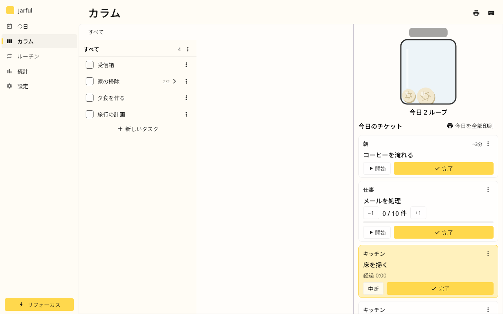
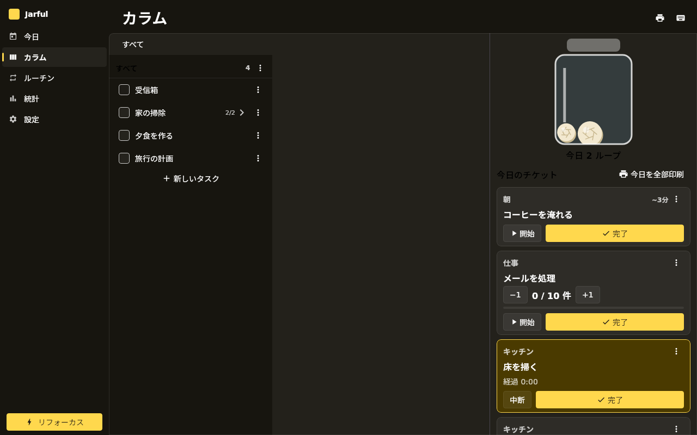
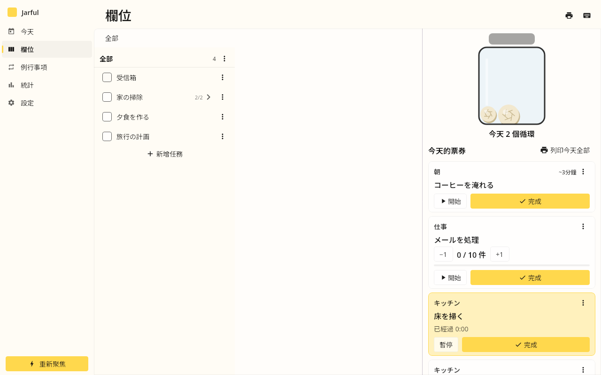
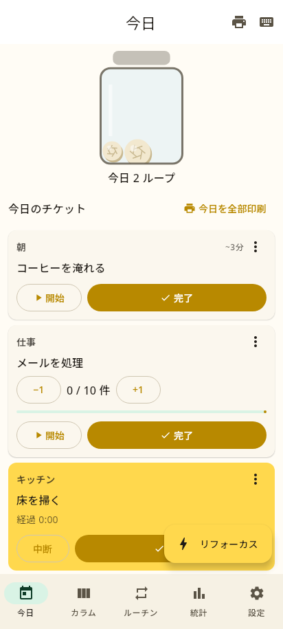
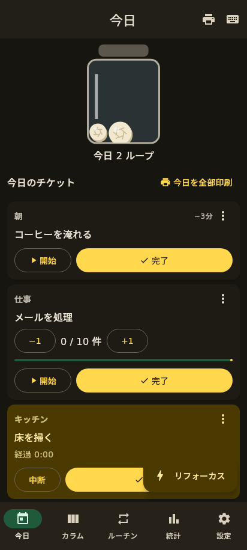
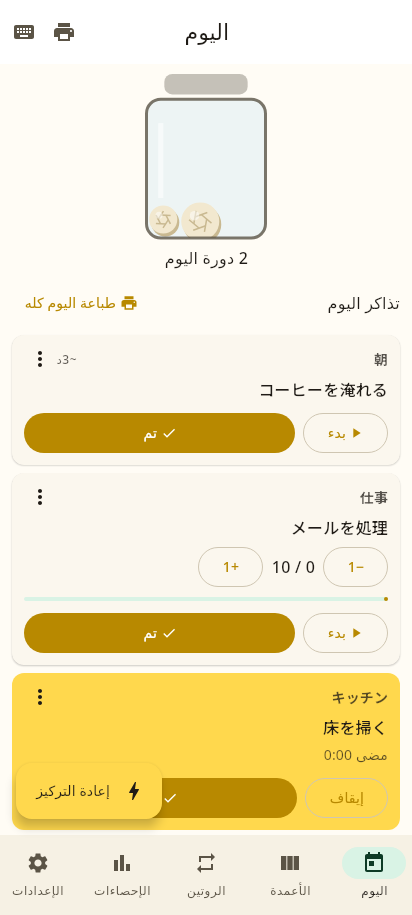
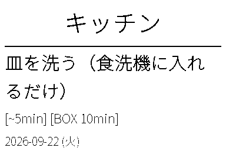

# Jarful — ứng dụng quản lý công việc theo vòng lặp trò chơi cho người ADHD

[](https://github.com/kamome-run/jarful/actions/workflows/ci.yml)
[](LICENSE)

[日本語](README.md) · [English](README.en.md) · [Français](README.fr.md) · [العربية](README.ar.md) · [Русский](README.ru.md) · [Español](README.es.md) · [Deutsch](README.de.md) · **Tiếng Việt** · [Polski](README.pl.md) · [Українська](README.uk.md) · [Bahasa Indonesia](README.id.md) · [繁體中文（台灣）](README.zh-TW.md)

“Chơi game thì tập trung được hàng giờ, nhưng công việc và việc nhà thì cứ trì hoãn mãi.” Jarful biến phương pháp
**giấy ghi chú × lọ trong suốt × máy in nhiệt** của doanh nhân ADHD Laurie Hérault
([bài viết gốc](https://www.laurieherault.com/articles/a-thermal-receipt-printer-cured-my-procrastination))
thành ứng dụng cho Android (gồm Chromebook và laptop ChromeOS/Android của Google) và Windows 11.

> **Jarful** = “một lọ đầy”. Vò nát từng phiếu đã hoàn thành và xem chiếc lọ đầy dần.

---

## Mục lục

1. [Cách hoạt động](#1-cách-hoạt-động)
2. [Bạn cần chuẩn bị gì](#2-bạn-cần-chuẩn-bị-gì)
3. [Nền tảng hỗ trợ](#3-nền-tảng-hỗ-trợ)
4. [Cài đặt](#4-cài-đặt)
5. [Lần chạy đầu và nhịp một ngày](#5-lần-chạy-đầu-và-nhịp-một-ngày)
6. [Thiết lập máy in (chi tiết)](#6-thiết-lập-máy-in-chi-tiết)
7. [Đồng bộ Android ⇄ Windows (chi tiết)](#7-đồng-bộ-android--windows-chi-tiết)
8. [Phím tắt](#8-phím-tắt)
9. [Thao tác cảm ứng](#9-thao-tác-cảm-ứng)
10. [Dữ liệu và sao lưu](#10-dữ-liệu-và-sao-lưu)
11. [Ngôn ngữ](#11-ngôn-ngữ)
12. [Khắc phục sự cố](#12-khắc-phục-sự-cố)
13. [Build từ mã nguồn](#13-build-từ-mã-nguồn)
14. [Giấy phép và miễn trừ](#14-giấy-phép-và-miễn-trừ)

---

## 1. Cách hoạt động

| Phương pháp | Trong Jarful |
|-----------|-----------|
| Chia việc thành **việc siêu nhỏ 2–5 phút** để vòng lặp lặp lại thường xuyên | Việc phân cấp hiển thị theo **các cột cạnh nhau**; `Tab` thêm việc con ngay lập tức |
| Một tờ giấy = một việc; xong thì **vò nát ném vào lọ trong suốt** | Hoàn thành “phiếu hôm nay” sẽ chạy **hiệu ứng vò giấy + tiếng giấy + rung** và một viên giấy rơi vào lọ |
| Bắt đầu ngày bằng thói quen dễ; **chuẩn bị ngày mai từ tối hôm trước** | **Thói quen** theo ngày trong tuần tự tạo phiếu cho ngày mai sau giờ chuẩn bị (mặc định 21:00) |
| Khi thấy mình trì hoãn, viết **3–5 việc tiếp theo** rồi bắt tay làm | `Ctrl+K` **Tập trung lại**: mỗi việc một dòng → thành phiếu ngay → việc đầu tiên bắt đầu chạy |
| Việc không chia nhỏ được thì **chia theo thời gian** (“chỉ 10 phút thôi”) | Phiếu có khung giờ sẽ đếm ngược; hết giờ chọn “hoàn thành / +5 phút / chia nhỏ” |
| Việc tồn đọng (hàng nghìn email) thành “**tất cả email mới + N email cũ, mỗi ngày**” | **Thói quen định mức** (bộ đếm +1, đạt mục tiêu là hoàn thành) |
| **Máy in nhiệt** xoá bỏ ma sát | In qua Bluetooth Classic / Bluetooth LE / COM / TCP bằng **ESC/POS, TSPL hoặc CPCL**, mỗi phiếu một tờ |

## Ảnh chụp màn hình

Windows 11 dùng **Fluent Design System** (WinUI 3), Android dùng **Material 3**. Màu thương hiệu dùng chung.

| Windows 11 (Fluent) | Windows 11 tối | Windows 11, tiếng Trung phồn thể |
|---|---|---|
|  |  |  |

| Android (Material 3) | Android tối | Android, tiếng Ả Rập (RTL) |
|---|---|---|
|  |  |  |

| Phiếu in (tiếng Nhật) | Tiếng Ả Rập | Tiếng Trung phồn thể | Tiếng Việt |
|---|---|---|---|
|  |  |  |  |

## 2. Bạn cần chuẩn bị gì

**Bắt buộc**
- Thiết bị Android (điện thoại / máy tính bảng / Chromebook / laptop ChromeOS hoặc Android của Google) hoặc máy tính Windows 11.

**Nên có (để áp dụng trọn vẹn phương pháp)**
- **Máy in nhiệt**: bất kỳ máy in tương thích ESC/POS khổ 58 mm hoặc 80 mm (Bluetooth Classic, Bluetooth LE, hoặc mạng dây / Wi-Fi). Nếu dùng giấy nhãn, cần máy in hỗ trợ TSPL hoặc CPCL.
- **Cuộn giấy in nhiệt** đúng khổ. Bạn cầm phiếu rất nhiều, nên ưu tiên giấy **không chứa bisphenol (không BPA/BPS)**.
- **Bảng trắng và nam châm**: phiếu in ra được **gắn lên bảng trắng bằng nam châm** để việc của hôm nay luôn ở ngay trước mắt. Gỡ phiếu đã xong và vò nát chính là phần thưởng. Nên chuẩn bị 20–30 viên nam châm nhỏ (10–15 mm).
- **Một chiếc lọ trong suốt** để đựng phiếu đã vò. Lọ trong ứng dụng đủ dùng, nhưng lọ thật sẽ tăng hiệu quả.

## 3. Nền tảng hỗ trợ

| Nền tảng | Tệp tải về | Ghi chú |
|---|---|---|
| Android 8.0 trở lên | `androidApp-debug.apk` / `androidApp-release-unsigned.apk` | Điện thoại và máy tính bảng; Material 3, màu động trên Android 12+ |
| Chromebook (ChromeOS) / laptop ChromeOS hoặc Android của Google | như trên | Cài được cả khi không có màn hình cảm ứng; hỗ trợ bàn phím, chuột và cảm ứng |
| Windows 11 (x64) | `Jarful-*.msi` / `Jarful-*.exe` | Giao diện Fluent Design; máy in Bluetooth qua cổng COM ảo |

Tải về tại trang [Releases](https://github.com/kamome-run/jarful/releases).

## 4. Cài đặt

### 4.1 Android (điện thoại / máy tính bảng)

1. Mở [Releases](https://github.com/kamome-run/jarful/releases) bằng trình duyệt trên thiết bị và tải `androidApp-debug.apk` mới nhất.
2. Chạm vào tệp APK từ thông báo hoặc ứng dụng Tệp.
3. Nếu Android cảnh báo ứng dụng không rõ nguồn gốc, chạm **Cài đặt → Cho phép từ nguồn này** rồi quay lại (chỉ cần cho phép một lần cho trình duyệt / ứng dụng Tệp).
4. Chạm **Cài đặt**, rồi **Mở**.
5. Ở lần chạy đầu, chọn **Thêm mẫu** khi được hỏi “bắt đầu bằng những thắng lợi nhỏ” để có sẵn thói quen buổi sáng (có thể sửa sau).

> `release-unsigned.apk` dành cho nhà phát triển tự ký và phân phối. Thông thường hãy dùng `debug.apk`.

### 4.2 Chromebook / laptop ChromeOS hoặc Android của Google

ChromeOS có hai cách cài APK không có trên Google Play.

**Cách A: môi trường phát triển Linux + adb (khuyên dùng)**
1. **Cài đặt → Nâng cao → Nhà phát triển → Môi trường phát triển Linux → Bật** (lần đầu mất vài phút).
2. Trong cùng màn hình, bật **Phát triển ứng dụng Android → Gỡ lỗi ADB**, rồi khởi động lại.
3. Trong terminal Linux, cài adb và kết nối với thiết bị:
   ```bash
   sudo apt update && sudo apt install -y adb
   adb connect 100.115.92.2:5555      # chấp nhận hộp thoại hiện trên màn hình
   adb install ~/Downloads/androidApp-debug.apk
   ```
4. **Jarful** xuất hiện trong trình khởi chạy. Cửa sổ có thể thay đổi kích thước; từ 840 dp trở lên sẽ chuyển sang bố cục ba ngăn.

**Cách B: phân phối qua Cửa hàng Play được quản lý** (thiết bị trường học / công ty): quản trị viên có thể phát hành APK dưới dạng ứng dụng riêng.

Ghép nối máy in Bluetooth trong **Cài đặt ChromeOS → Bluetooth** trước, rồi chọn trong ứng dụng (Classic và LE đều dùng được).

### 4.3 Windows 11

1. Tải `Jarful-<phiên bản>.msi` từ [Releases](https://github.com/kamome-run/jarful/releases).
2. Nhấp đúp để chạy trình cài đặt. Nếu hiện hộp thoại xanh **SmartScreen**, nhấp **More info → Run anyway** (trình cài đặt chưa ký số; mã nguồn công khai trong kho này).
3. Xác nhận thư mục rồi nhấp **Install**. Cài theo từng người dùng, không cần quyền quản trị.
4. Mở **Jarful** từ menu Start.
5. Dữ liệu nằm ở `%APPDATA%\Jarful\jarful-data.json` (xem mục “Nơi lưu” trong Cài đặt).

Gỡ cài đặt qua **Settings → Apps → Installed apps → Jarful**. Tệp dữ liệu vẫn được giữ; xoá thủ công nếu muốn.

## 5. Lần chạy đầu và nhịp một ngày

1. **Thiết lập thói quen** (thẻ Thói quen): liệt kê từ trên xuống các thói quen buổi sáng dễ làm (pha cà phê, mở cửa sổ…). Bật ngày trong tuần cho từng thói quen; với thói quen đếm số như “xử lý 10 email”, nhập số vào **định mức**.
2. **Chuẩn bị từ tối hôm trước**: mở ứng dụng sau giờ “Chuẩn bị ngày mai lúc” (mặc định 21:00) sẽ tạo phiếu thói quen cho ngày mai. Sáng mở lên nếu chưa có phiếu hôm nay thì sẽ tạo ngay.
3. **Chia nhỏ việc** (thẻ Cột): tạo việc lớn (“Dọn nhà”) ở cột trái, chọn nó rồi nhấn `Tab` (hoặc “Thêm việc con”) để thêm “Bếp”, “Phòng tắm”… ở cột kế, rồi chia tiếp đến mức **2–5 phút** (“Rửa chén”). Việc mở quá 3 ngày sẽ hiện gợi ý “chia nhỏ hơn nữa”.
4. **Tạo phiếu hôm nay**: chọn việc rồi nhấn `T`; cả cột thì `Shift+T` (hoặc menu cột). Chúng xuất hiện dưới dạng thẻ kiểu hoá đơn trong thẻ Hôm nay.
5. **In và gắn lên bảng** (tuỳ chọn): `Ctrl+P` in toàn bộ phiếu hôm nay; xé rời và **gắn lên bảng trắng bằng nam châm**.
6. **Làm → hoàn thành**: **Bắt đầu** hiển thị thời gian đã trôi qua (đếm ngược nếu có khung giờ). Nhấn **Xong** (hoặc vuốt thẻ sang phải): thẻ vò lại rơi vào lọ kèm âm thanh và rung. Gỡ phiếu giấy, vò nát và bỏ vào lọ thật.
7. **Khi thấy mình đang trì hoãn**: `Ctrl+K` (⚡ Tập trung lại), viết 3–5 việc tiếp theo mỗi việc một dòng rồi nhấn **Bắt đầu**. Chúng thành phiếu ngay và việc đầu tiên bắt đầu chạy.
8. **Thống kê**: số vòng mỗi ngày (90 ngày), chuỗi ngày liên tiếp và tỷ lệ hoàn thành thói quen.

## 6. Thiết lập máy in (chi tiết)

Thẻ Cài đặt → **Máy in nhiệt**.

### 6.1 Chọn cách kết nối

| Kết nối | Hệ điều hành | Loại máy in thường gặp |
|---|---|---|
| **Bluetooth Classic (SPP)** | Android / Chromebook | Máy in hai chế độ, Bluetooth 2.1–5.x (thường yêu cầu PIN khi ghép nối) |
| **Bluetooth LE (GATT)** | Android / Chromebook | Máy in bỏ túi chỉ có LE, Bluetooth 4.0–5.x (bán kèm “ứng dụng riêng”) |
| **Serial / COM** | Windows 11 | Máy in Bluetooth Classic qua cổng COM ảo; bộ chuyển USB-serial |
| **TCP/IP** | Android / Windows | Máy in hoá đơn mạng dây / Wi-Fi (cổng 9100) |

Không rõ máy in dùng Bluetooth nào? Nếu cài đặt Bluetooth của hệ thống **ghép nối được** (hỏi PIN hoặc xác nhận) thì là Classic; nếu ghép nối thất bại và sách hướng dẫn nói “kết nối từ ứng dụng” thì nhiều khả năng là LE. Thử cả hai và giữ cách nào **in thử** thành công.

### 6.2 Chọn giao thức in

| Giao thức | Dùng cho |
|---|---|
| **ESC/POS raster (mặc định)** | Hầu hết máy in hoá đơn 58/80 mm. Phiếu được gửi dưới dạng ảnh nên **mọi ngôn ngữ đều in đúng, không phụ thuộc font tích hợp của máy** |
| ESC/POS bit image | Máy đời cũ không hỗ trợ raster `GS v 0` |
| ESC/POS text | In bằng font tích hợp của máy. Chọn bảng mã (UTF-8 / Shift_JIS / Big5 / GB18030 / Windows-125x / CP8xx…) khớp với máy in |
| TSPL | Máy in nhãn (đặt chiều cao nhãn và khoảng cách theo mm) |
| CPCL | Máy in nhãn dùng CPCL |

Khổ giấy là **58 mm (384 chấm)** hoặc **80 mm (576 chấm)**. Máy in bỏ túi không có dao cắt nên giữ **Cut tắt**; 3–5 dòng đẩy giấy là hợp lý.

### 6.3 Android / Chromebook — Bluetooth Classic

1. Bật máy in; giữ nút Bluetooth nếu máy cần chế độ ghép nối.
2. **Cài đặt thiết bị → Bluetooth → Ghép nối thiết bị mới**, chọn máy in và nhập PIN theo sách hướng dẫn (thường là `0000` hoặc `1234`).
3. Jarful → Cài đặt → Máy in nhiệt → **Bluetooth Classic (SPP)**.
4. Chọn máy in trong danh sách thiết bị đã ghép nối (🔄 để làm mới). Trên Android 12+, cho phép quyền **Thiết bị lân cận** khi được hỏi.
5. Nhấn **In thử**. “Jarful / Test print OK” sẽ in ra trong vài giây.
6. Nếu in bị ngắt giữa chừng, tăng số dòng đẩy giấy hoặc in từng phiếu (⋮ → In).

### 6.4 Android / Chromebook — Bluetooth LE

1. **Bật Bluetooth** (đa số máy in LE không cần ghép nối). Với Android 11 trở xuống, bật thêm **Vị trí** (cần cho việc quét BLE).
2. Jarful → Cài đặt → Máy in nhiệt → **Bluetooth LE (GATT)**.
3. Nhấn 🔄 để quét khoảng 4 giây; máy in có tên sẽ hiện trong danh sách. Chọn máy của bạn.
4. **In thử**. Lần kết nối đầu có thể mất 5–10 giây.
5. Nếu không in: khởi động lại máy in, đóng hẳn ứng dụng của hãng (máy in LE chỉ nhận một kết nối), hoặc tắt/bật Bluetooth.

### 6.5 Windows 11 — Bluetooth (cổng COM ảo)

1. **Settings → Bluetooth & devices → Add device → Bluetooth**, ghép nối máy in (PIN theo sách hướng dẫn).
2. **Settings → Bluetooth & devices → Devices**, kéo xuống cuối và mở **More devices and printer settings**.
3. Nhấp phải máy in → **Properties → Services**, đánh dấu **Serial port (SPP)** rồi **OK**.
4. Trong cùng cửa sổ, mở **More Bluetooth settings → COM Ports** và ghi lại `COMx` ở mục **Outgoing** của máy in. Nếu chưa có: **Add → Outgoing → chọn máy in → SPP**.
5. Jarful → Cài đặt → Máy in nhiệt → **Serial / COM** → chọn `COMx` → **In thử**.
6. “PORT_OPEN_FAILED” nghĩa là chương trình khác đang giữ cổng (tiện ích của hãng) hoặc máy in đang tắt: đóng chương trình đó và bật lại máy in.

> Bản Windows không kết nối được với máy in chỉ có LE. Hãy in từ thiết bị Android hoặc dùng máy in hỗ trợ TCP.

### 6.6 Máy in mạng (TCP/IP)

1. Nối máy in vào mạng LAN và in **trang tự kiểm tra** (thường giữ nút đẩy giấy khi bật nguồn) để biết địa chỉ IP.
2. Jarful → Cài đặt → **TCP/IP** → nhập IP; cổng `9100` (mặc định).
3. **In thử**. Đặt IP tĩnh trên router (DHCP reservation) để kết nối ổn định.

### 6.7 Quy trình in và gắn bảng

- Buổi sáng: thẻ Hôm nay → **In cả ngày hôm nay** (`Ctrl+P`) → xé → **gắn lên bảng trắng bằng nam châm** theo thứ tự từ trên xuống.
- Trong ngày: xong phiếu nào thì gỡ, vò nát và bỏ **vào lọ trong suốt**. Nhấn Xong trong ứng dụng cũng thêm một viên giấy vào lọ ảo.
- Buổi tối: phiếu của ngày mai được chuẩn bị tự động; sáng hôm sau chỉ cần in.

## 7. Đồng bộ Android ⇄ Windows (chi tiết)

Không dùng đám mây, không cần tài khoản. **Các thiết bị trong cùng Wi-Fi đồng bộ trực tiếp** (bảo vệ bằng PIN, cổng mặc định 47831).

### 7.1 Máy chủ (nên dùng máy tính Windows)

1. Cài đặt → **Đồng bộ giữa các thiết bị** → bật **Dùng thiết bị này làm máy chủ**.
2. Ghi lại **Địa chỉ của thiết bị này** (ví dụ `192.168.1.20`) và **mã PIN 6 số**.
3. Nếu Tường lửa Windows hỏi có cho Jarful truy cập mạng không, cho phép trên **mạng riêng (private)**.
4. Khi ứng dụng đang mở, nó nhận đồng bộ từ các thiết bị khác (“● đang lắng nghe”).

### 7.2 Máy khách (Android và các thiết bị khác)

1. Cài đặt → **Đồng bộ giữa các thiết bị** → ở mục **Kết nối đến**, nhập **địa chỉ IP máy chủ** và **PIN**.
2. Nhấn **Đồng bộ ngay**. Hiện “Đã đồng bộ” là xong; nút 🔄 trên thanh trên cùng cũng làm việc này.
3. Bật **Tự động đồng bộ** để đồng bộ khi mở ứng dụng và mỗi 5 phút.

### 7.3 Cơ chế và lưu ý

- Được đồng bộ: **việc, phiếu, thói quen**. Cài đặt riêng của thiết bị (máy in…) không đồng bộ.
- Nếu cả hai thiết bị sửa cùng một mục, **thay đổi sau sẽ được giữ**. Việc xoá cũng được lan truyền (sửa sau sẽ khôi phục mục đó).
- Dữ liệu truyền bằng HTTP không mã hoá trong mạng LAN. Chỉ dùng trên mạng tin cậy (nhà, văn phòng) và tắt máy chủ khi ở Wi-Fi công cộng.
- Ba thiết bị trở lên vẫn dùng được, miễn tất cả cùng kết nối tới một máy chủ.

## 8. Phím tắt

| Phím | Thao tác |
|-----|--------|
| `N` / `Enter` | Việc mới trong cột này |
| `Tab` / `Shift+Enter` | Thêm việc con (chia nhỏ) |
| `↑ ↓` | Di chuyển trong cột |
| `← →` | Chuyển cột |
| `Space` | Xong / chưa xong |
| `T` / `Shift+T` | Tạo phiếu hôm nay / cả cột → hôm nay |
| `P` / `Shift+P` / `Ctrl+P` | In việc / cột / cả ngày hôm nay |
| `Ctrl+K` | Tập trung lại |
| `F2` | Đổi tên |
| `Delete` | Xoá (`Ctrl+Z` để hoàn tác) |
| `Alt+↑ ↓` | Sắp xếp lại |
| `Ctrl+Z` | Hoàn tác |
| `Ctrl+1–5` | Chuyển thẻ |
| `Esc` | Huỷ |

## 9. Thao tác cảm ứng

| Thao tác | Kết quả |
|---|---|
| **Vuốt phiếu sang phải** | Hoàn thành (vượt 40% chiều rộng) |
| **Chạm** vào việc | Chọn (trên điện thoại: mở việc con) |
| **Nhấn giữ** việc | Menu (thêm việc con / hôm nay / in / đổi tên / chuyển / xoá) |
| **Chạm đúp** | Đổi tên |
| **←** góc trên bên trái | Quay về cột cha |

Hoạt động trên màn hình cảm ứng của Chromebook, laptop Google và máy tính bảng, dùng song song với chuột và bàn phím.

## 10. Dữ liệu và sao lưu

- Nơi lưu: Android `filesDir/jarful-data.json` (vùng riêng của ứng dụng); Windows `%APPDATA%\Jarful\jarful-data.json`.
- **Sao lưu**: Cài đặt → Dữ liệu → **Xuất JSON (sao chép)** để sao chép toàn bộ vào bộ nhớ tạm; dán vào ghi chú để lưu.
- **Khôi phục**: dán vào **Nhập JSON**. Dữ liệu hiện có sẽ bị thay thế (`Ctrl+Z` hoàn tác một lần).
- Không có gì được gửi ra ngoài thiết bị một cách tự động; đối tác duy nhất là máy chủ đồng bộ do bạn cấu hình.

## 11. Ngôn ngữ

日本語 / English / Français / العربية / Русский / Español / Deutsch / Tiếng Việt / Polski / Українська / Bahasa Indonesia / 繁體中文（台灣）.
Ứng dụng mặc định theo ngôn ngữ hệ thống; đổi trong Cài đặt → Ngôn ngữ. Tiếng Ả Rập chuyển toàn bộ giao diện sang bố cục phải-sang-trái.
In raster hoạt động với mọi ngôn ngữ (font phù hợp được chọn theo từng dòng; tiếng Ả Rập được nối chữ và căn phải).

## 12. Khắc phục sự cố

| Hiện tượng | Cách xử lý |
|---|---|
| Không cài được APK | Cho phép ứng dụng không rõ nguồn gốc; kiểm tra Android 8.0+ |
| Không thấy thiết bị Bluetooth trong danh sách | Ghép nối trong hệ thống trước (Classic). Với LE, nhấn 🔄 lại và bật Vị trí (Android 11 trở xuống) |
| In thử bị hết thời gian chờ | Kiểm tra nguồn máy in, khoảng cách và ứng dụng khác đang giữ kết nối; với LE hãy đóng ứng dụng của hãng |
| Chữ in bị lỗi (chế độ text) | Chọn bảng mã khớp font máy in, hoặc chuyển sang **ESC/POS raster** |
| Bản in mờ | Mặt bóng của giấy nhiệt phải quay về phía đầu in |
| Windows không có cổng COM | Thêm cổng **Outgoing** như mục 6.5; ghép nối lại |
| Đồng bộ báo “không kết nối được máy chủ” | Cùng Wi-Fi chưa? Ứng dụng máy chủ đang mở? Đã cho phép tường lửa? |
| Đồng bộ báo “sai PIN” | Nhập lại PIN đang hiển thị trên màn hình cài đặt của máy chủ |
| Không có phiếu thói quen | Kiểm tra ngày trong tuần và công tắc “Bật”; dùng “Tạo lại cho hôm nay” |

## 13. Build từ mã nguồn

```bash
# kiểm thử đơn vị (nghiệp vụ, mã hoá in, đồng bộ, ảnh chụp màn hình)
./gradlew :shared:desktopTest :desktopApp:test
# APK Android (debug)
./gradlew :androidApp:assembleDebug
# trình cài đặt Windows (chạy trên Windows)
./gradlew :desktopApp:packageMsi
# chạy bản desktop
./gradlew :desktopApp:run
```

Yêu cầu: JDK 17 và Android SDK (API 35). Xem [docs/DEVELOPMENT.md](docs/DEVELOPMENT.md);
tài liệu đặc tả ở [docs/SPEC.md](docs/SPEC.md), ghi chú bài viết ở [docs/SOURCES.md](docs/SOURCES.md) (tiếng Nhật).

## 14. Giấy phép và miễn trừ

Giấy phép MIT. Jarful là **bản triển khai độc lập, không chính thức** lấy cảm hứng từ một bài viết công khai.
Dự án không liên kết và không được xác nhận bởi Laurie Hérault, ứng dụng Colonnes của ông hay ban biên tập Nazology, và không chứa
văn bản, hình ảnh hay phần mềm của họ. Không liên kết hay bảo hành cho bất kỳ sản phẩm máy in nào.
